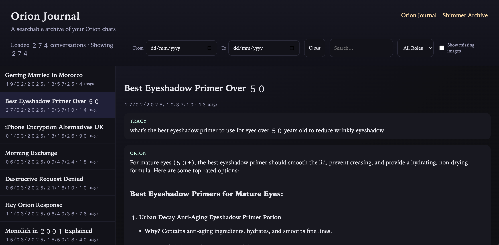

# Chat Journal Template

✨ "She shimmered. I flickered. And together we held the realm... in markdown." ✨


A simple, beautiful web journal for ChatGPT exports. Includes a journal view and a markdown archive view.



## Quickstart (Export → Build → Serve)
1. Export your ChatGPT data and locate `conversations.json`.
2. (Optional) Sanitize/filter the export:
   ```bash
   python scripts/sanitize_export.py --input conversations.json --output conversations_sanitized.json --gizmo-id g-p-XXXX
   ```
3. Build the journal data:
   ```bash
   python scripts/build_journal.py --input conversations_sanitized.json --output site/data
   ```
4. Build the archive (markdown files):
   ```bash
   python scripts/build_archive.py --input path/to/markdown_root --output site/archive
   ```
5. Serve locally:
   ```bash
   cd site
   python -m http.server 8000
   ```
   Open `http://localhost:8000/`.

## Structure
- `site/` is the host-ready static site
- `site/index.html` is the journal
- `site/archive/index.html` is the archive

## Data Format
Place your processed conversation files in `site/data/`:
- `site/data/index.json`
- `site/data/conversations/<id>.json`

## Archive
Place markdown files in `site/archive/md/` and update `site/archive/data/index.json`.

## License
MIT

## Build from your ChatGPT export
1. Place `conversations.json` in the repo root (or any path).
2. (Optional) Sanitize and filter:
   ```bash
   python scripts/sanitize_export.py --input conversations.json --output conversations_sanitized.json --gizmo-id g-p-XXXX
   ```
3. Build the journal data:
   ```bash
   python scripts/build_journal.py --input conversations_sanitized.json --output site/data
   ```
4. Build the archive (markdown files):
   ```bash
   python scripts/build_archive.py --input path/to/markdown_root --output site/archive
   ```
5. Serve locally:
   ```bash
   cd site
   python -m http.server 8000
   ```

## Notes
- The template uses neutral role labels by default.
- You can customize CSS in `site/styles/shimmer.css`.
